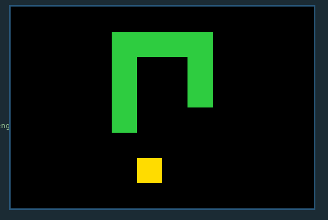

# Snake Game in 2D



All course notes and exercises are in
[UltiRequiem/ruby-platzi](https://github.com/UltiRequiem/ruby-platzi).

## Features

- Vim Key Bindings

## Required Packages

On Arch:

```bash
sudo pacman -S sdl2 sdl2_image sdl2_mixer sdl2_ttf
```

On Debian derivates:

```bash
sudo apt install libsdl2-dev libsdl2-image-dev libsdl2-mixer-dev libsdl2-ttf-dev
```

Gem: [Ruby 2D](https://www.ruby2d.com)

### LICENSE

[MIT](./LICENSE)
